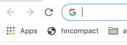
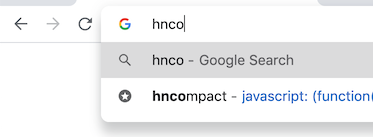
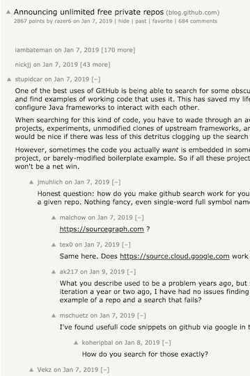
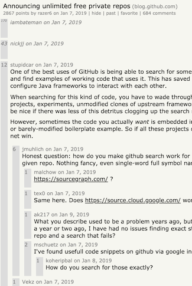

# Bookmarklets
This repository contains JavaScript intended to be saved as bookmarks in the web browser. Some of them change how the pages look, some add/remove features.


<!-- MarkdownTOC autolink="true" -->

- [Installation](#installation)
- [Usage](#usage)
- [Description](#description)
    - [hncompact.js](#hncompactjs)
    - [html5outliner.js](#html5outlinerjs)
    - [defaultcursor.js](#defaultcursorjs)
    - [defaultscroll.js](#defaultscrolljs)
    - [ytthumbnail.js](#ytthumbnailjs)
- [Notes](#notes)

<!-- /MarkdownTOC -->

## Installation
1. Bookmark this page (or any page to create a new bookmark)
1. Edit the bookmark
1. Replace the bookmark's URL with the contents of whichever JavaScript you'd like to install
1. Place on your web browser's bookmarks bar for ease of use

## Usage
If the bookmark is on the Bookmarks Bar, click it to execute the JavaScript. 



You can also type a portion of its name in the address/location bar, and select it from the dropdown to activate.



## Description
#### hncompact.js
Rewrites a [Hacker News](https://news.ycombinator.com) comment thread to have collapsible buttons along the left edge of each post, instead of just a small ```[-]``` to the right of each comment's date. Run after visiting a comment thread.
<details>
    <summary>Click here to see it in action.</summary>
    <table>
        <tr>
            <td>Before</td>
            <td>After</td>
        </tr>
        <tr>
            <td></td>
            <td></td>
        </tr>
    </table>
</details>

#### html5outliner.js
This is an edit of [html5outliner](https://github.com/hoyois/html5outliner) by hoyois, which creates an outline of a page using e.g. the HTML's header tags. This edit makes the outline popup in a new window instead of being overlaid in the page, and allows you to interact with the page without dismissing the outline.

#### defaultcursor.js
Removes custom cursors set by the page's CSS.
#### defaultscroll.js
Restores "normal" scrolling. Applies to smooth scrolling set by CSS only (i.e. doesn't affect any changes made in JavaScript).
#### ytthumbnail.js
Shows the thumbnail for the video you are on.

## Notes
Only tested on Google Chrome. Some browsers have a length limit on bookmarks, so you may need to "minify" the scripts before using them.
